# 第五週作業

## 要求三
1. INSERT INTO user (name, username, password) VALUES ("Jeff", "ply", "ply");
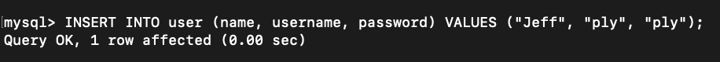
2. SELECT * FROM user;
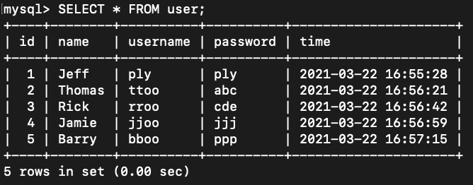
3. SELECT COUNT( * ) FROM user;
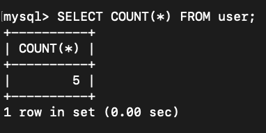
4. SELECT * FROM user ORDER BY time DESC;
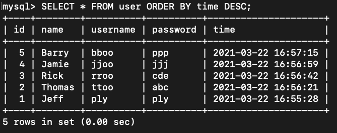
5. SELECT * FROM user ORDER BY time DESC LIMIT 1,3;
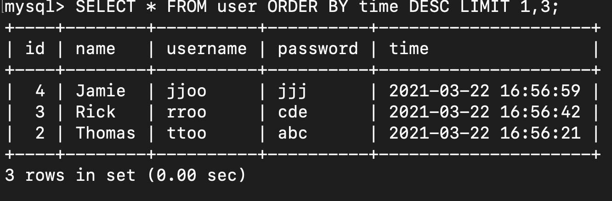
6. SELECT * FROM user WHERE username = 'ply';
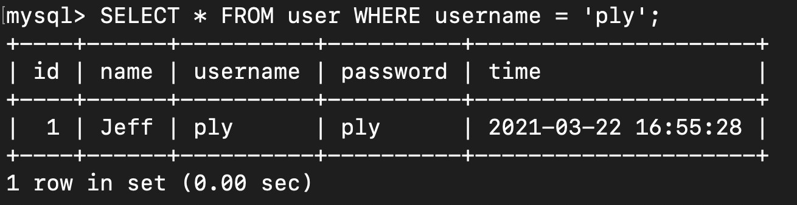
7. SELECT * FROM user WHERE username = 'ply' AND password = 'ply';
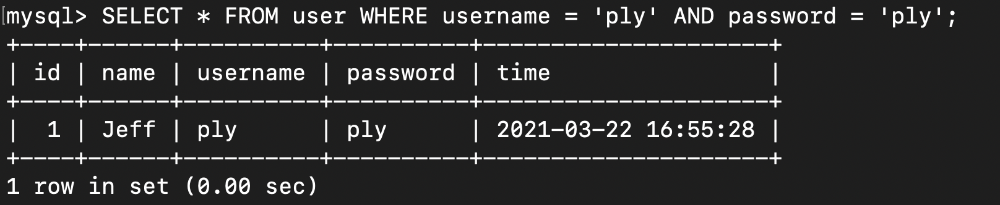
8. UPDATE user SET name = '丁滿' WHERE username = 'ply';
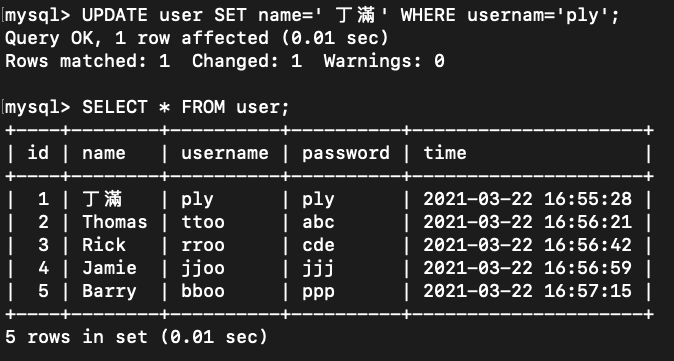
9. DELETE FROM user;
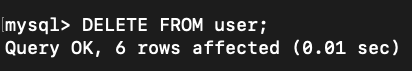
## 要求四
1. SELECT name,content FROM user JOIN message ON user.id = message.user_id;
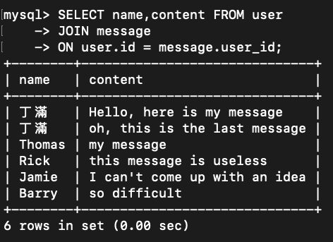
2. SELECT name,content FROM user JOIN message ON user.id = message.user_id AND user.username = 'ply';
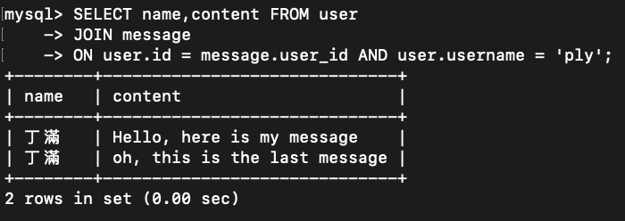
